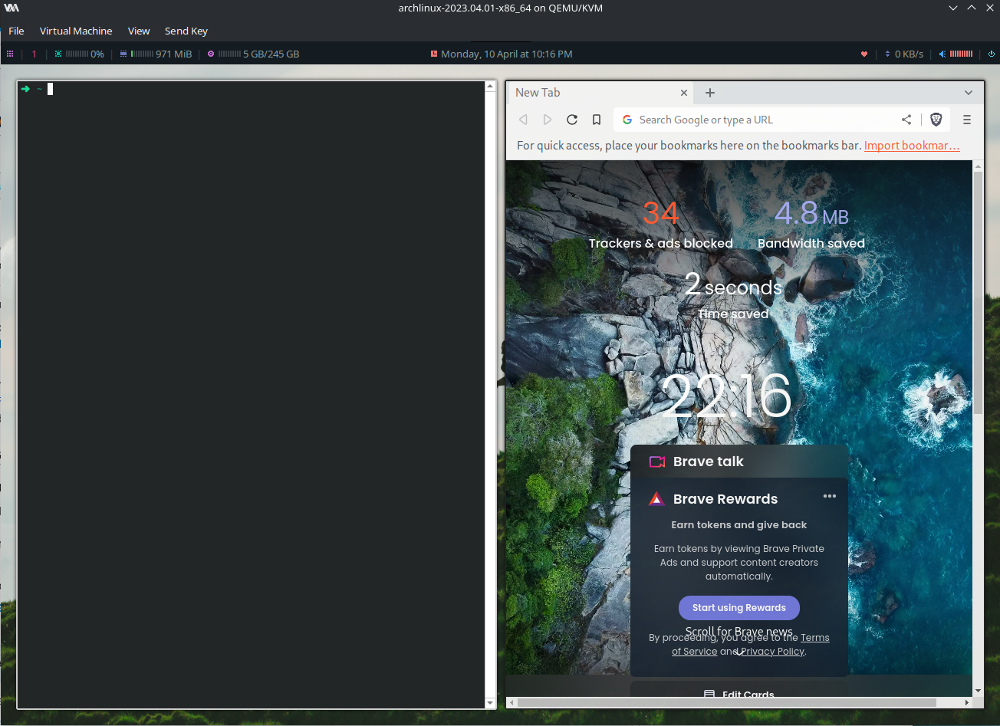

# Prerequisites

Host dependencies:
1. python3 (probs already installed)
2. ansible-core (via python)
3. sshpass? (via package manager)

Guest dependencies:
1. Booted into live CD

# How it works

Ansible connects as root via SSH to the guests and bootstraps/sets them up.

# Running

1. Boot the archlinux VM from the live CD.
2. Set the root password to `root` via `passwd`.
3. Run `ip address show` and add the IP address into `inventory.yaml`.

```bash
ANSIBLE_HOST_KEY_CHECKING=false ansible-playbook \
  -i inventory.yaml  \
  --user root \
  --ask-pass \
  archlinux-bootstrap.yaml
```

4. The VM will shutdown after bootstrapping. If it reboots into the live CD, power it off.
5. Follow the bootstrap instructions emitted by Ansible.


```bash
ANSIBLE_HOST_KEY_CHECKING=false ansible-playbook \
  -i inventory.yaml  \
  --user root \
  --ask-pass \
  archlinux-setup.yaml
```

6. Enable automatic VM resizing in virt-manager.

Once complete, you should boot into a VM that looks like this:


